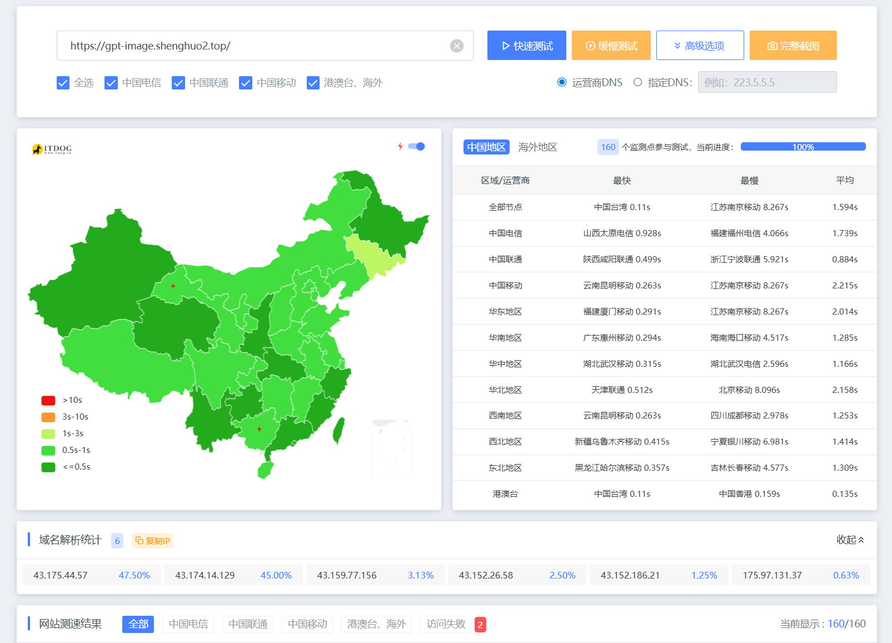

# GitHub Pages vs EdgeOne Pages 测速对比

使用 [itdog.cn](https://itdog.cn) 全国 160 个检测点（电信 / 联通 / 移动 / 海外）对比测试。

## 背景

EdgeOne Pages 默认部署域名（`*.edgeone.app`）的访问限制因地区而异：

- **中国大陆**：严格要求使用系统生成的预览链接访问（有效期 3 小时），过期返回 401 UNAUTHORIZED
- **非中国大陆**：通常可直接访问项目/部署域名，不受预览链接限制

绑定自定义域名后全球均可正常访问，以下测试使用自定义域名 `gpt-image.shenghuo2.top` 进行。

## 总览

| | GitHub Pages | EdgeOne Pages (自定义域名) |
|---|---|---|
| 移动网络 | 大量失败（DNS 污染） | 基本可达，偶发超时 |
| 电信 | 可访问，部分慢 | 全可达 |
| 联通 | 可访问，偶发失败 | 全可达，延迟低 |
| 海外 | 快速 | 快速，全球节点就近接入 |

## 结论

GitHub Pages 在国内移动网络几乎全军覆没，EdgeOne Pages 自定义域名三网均可访问，推荐使用。

## GitHub Pages 详细数据

| 检测点 | 响应IP | IP位置 | 状态 | 总耗时 | 解析 | 连接 | 下载 | 重定向 |
|---|---|---|---|---|---|---|---|---|
| 电信 湖北武汉 | 185.199.109.153 | Anycast/github.com | 200 | 5.143s | 0.005s | 0.461s | 3.110s | 2次 (3.699s) |
| 电信 甘肃兰州 | 185.199.110.153 | Anycast/github.com | 200 | 1.349s | 0.002s | 0.466s | 0.597s | 2次 (1.192s) |
| 电信 山西太原 | 185.199.108.153 | Anycast/github.com | 200 | 1.160s | 0.004s | 0.328s | 0.658s | 2次 (0.828s) |
| 电信 浙江宁波 | 185.199.111.153 | Anycast/github.com | 200 | 2.916s | 0.004s | 0.276s | 2.521s | 2次 (1.047s) |
| 电信 陕西西安 | 185.199.109.153 | Anycast/github.com | 200 | 4.947s | 0.002s | 0.460s | 2.715s | 2次 (4.051s) |
| 联通 山东泰安 | 185.199.111.153 | Anycast/github.com | 200 | 8.021s | 0.002s | 0.224s | 2.036s | 2次 (7.656s) |
| 联通 山东济南 | 185.199.108.153 | Anycast/github.com | 失败 | 10.005s | 0.003s | 0.001s | 10.002s | -- |
| 联通 辽宁沈阳 | 185.199.110.153 | Anycast/github.com | 失败 | 10.004s | 0.001s | 0.001s | 10.003s | -- |
| 移动 广东江门 | 185.199.111.153 | Anycast/github.com | 失败 | 0.111s | 0.002s | 0.075s | 0.034s | -- |
| 移动 四川成都 | 185.199.110.153 | Anycast/github.com | 失败 | 0.346s | 0.104s | 0.204s | 0.038s | -- |
| ... | ... | ... | ... | ... | ... | ... | ... | ... |

> 完整 160 行数据见 [itdog 测试结果](https://itdog.cn)。移动网络几乎全部失败（DNS 污染），电信联通部分超时。

## EdgeOne Pages 自定义域名 详细数据

| 检测点 | 响应IP | IP位置 | 状态 | 总耗时 | 解析 | 连接 | 下载 |
|---|---|---|---|---|---|---|---|
| 电信 福建福州 | 43.174.14.129 | 新加坡/腾讯云 | 200 | 4.066s | 0.004s | 0.366s | 2.048s |
| 电信 上海 | 43.174.14.129 | 新加坡/腾讯云 | 200 | 3.480s | 0.002s | 0.327s | 1.680s |
| 电信 北京 | 43.175.44.57 | 香港/腾讯云 | 200 | 3.493s | 0.003s | 0.323s | 1.815s |
| 电信 海南海口 | 43.174.14.129 | 新加坡/腾讯云 | 200 | 1.115s | 0.002s | 0.368s | 0.373s |
| 电信 山西太原 | 43.175.44.57 | 香港/腾讯云 | 200 | 0.928s | 0.003s | 0.304s | 0.310s |
| 联通 陕西咸阳 | 43.175.44.57 | 香港/腾讯云 | 200 | 0.499s | 0.002s | 0.161s | 0.171s |
| 联通 天津 | 43.175.44.57 | 香港/腾讯云 | 200 | 0.512s | 0.003s | 0.167s | 0.171s |
| 联通 上海 | 43.175.44.57 | 香港/腾讯云 | 200 | 0.543s | 0.008s | 0.176s | 0.180s |
| 联通 北京 | 43.175.44.57 | 香港/腾讯云 | 200 | 0.611s | 0.107s | 0.166s | 0.168s |
| 移动 云南昆明 | 43.175.44.57 | 香港/腾讯云 | 200 | 0.263s | 0.024s | 0.098s | 0.051s |
| 移动 广东惠州 | 43.174.14.129 | 新加坡/腾讯云 | 200 | 0.294s | 0.003s | 0.093s | 0.098s |
| 移动 浙江宁波 | 43.174.14.129 | 新加坡/腾讯云 | 200 | 0.305s | 0.001s | 0.097s | 0.106s |
| 移动 湖北武汉 | 43.174.14.129 | 新加坡/腾讯云 | 200 | 0.315s | 0.004s | 0.102s | 0.104s |
| 移动 甘肃兰州 | 43.175.44.57 | 香港/腾讯云 | 失败 | 10.095s | 0.094s | 2.152s | 5.107s |
| 移动 广西南宁 | 43.174.14.129 | 新加坡/腾讯云 | 失败 | 10.004s | 0.003s | 0.001s | 10.002s |
| 海外 美国洛杉矶 | 43.159.77.156 | 洛杉矶/腾讯云 | 200 | 0.009s | 0.003s | 0.001s | 0.002s |
| 海外 德国法兰克福 | 43.152.26.58 | 法兰克福/腾讯云 | 200 | 0.011s | 0.004s | 0.001s | 0.003s |
| 海外 新加坡 | 43.174.14.129 | 新加坡/腾讯云 | 200 | 0.792s | 0.780s | 0.003s | 0.004s |
| ... | ... | ... | ... | ... | ... | ... | ... |

> 完整 160 行数据见 [itdog 测试结果](https://itdog.cn)。三网均可正常返回 200，仅极个别检测点超时。

## 关键发现

- **自定义域名是必需的**：EdgeOne Pages 默认域名有访问限制（3 小时过期/401），绑定自定义域名后恢复正常
- **移动网络**：GitHub Pages 几乎全挂（DNS 污染），EdgeOne 不受影响
- **电信 / 联通**：两者均可用，EdgeOne 延迟更低（联通平均 < 1s）
- **海外**：EdgeOne 使用腾讯云全球节点（新加坡/香港/洛杉矶/法兰克福），就近接入，延迟极低
- **推荐 EdgeOne Pages + 自定义域名** 作为国内用户的主要入口
