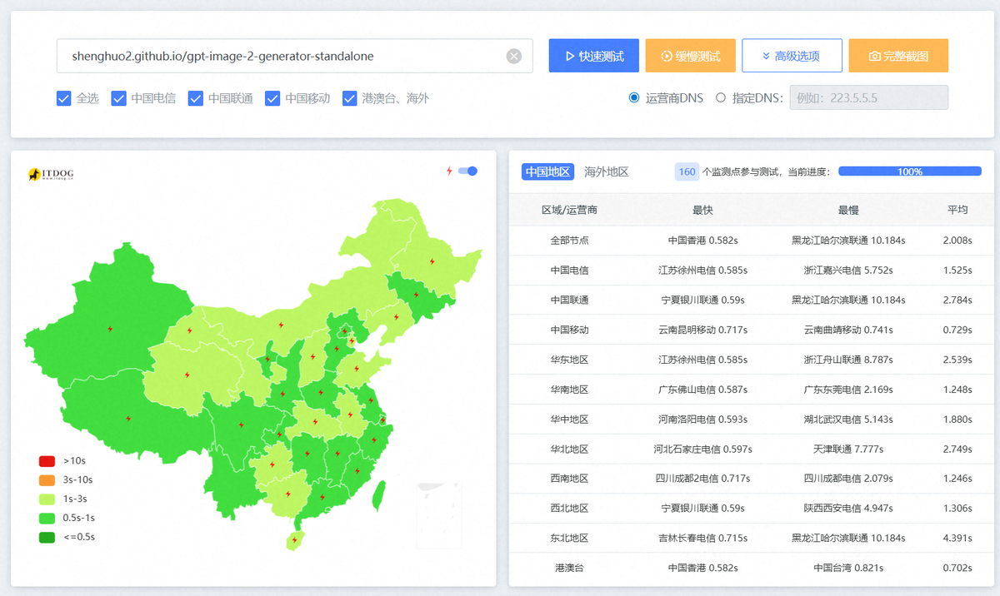
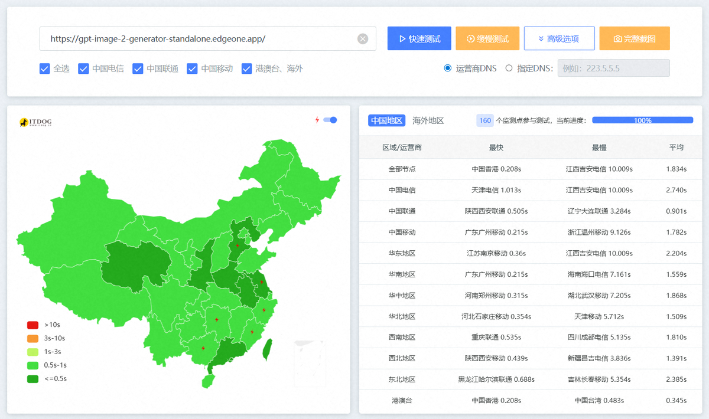

# GitHub Pages vs EdgeOne Pages 测速对比

使用 [itdog.cn](https://itdog.cn) 全国 160 个检测点（电信 / 联通 / 移动 / 海外）对比测试。

## 总览

| | GitHub Pages | EdgeOne Pages |
|---|---|---|
| 移动网络 | 大量失败（DNS 污染） | 基本可达 |
| 电信 | 可访问，部分慢 | 全可达 |
| 联通 | 可访问，偶发失败 | 全可达 |
| 海外 | 快速 | 快速，节点更近 |

## 结论

GitHub Pages 在国内移动网络几乎全军覆没，EdgeOne Pages 三网均可访问，推荐使用。

## GitHub Pages 详细数据

| 检测点 | 响应IP | IP位置 | 状态 | 总耗时 | 解析 | 连接 | 下载 | 重定向 |
|---|---|---|---|---|---|---|---|---|
| 电信 湖北武汉 | 185.199.109.153 | Anycast/github.com | 200 | 5.143s | 0.005s | 0.461s | 3.110s | 2次 (3.699s) |
| 电信 甘肃兰州 | 185.199.110.153 | Anycast/github.com | 200 | 1.349s | 0.002s | 0.466s | 0.597s | 2次 (1.192s) |
| 电信 山西太原 | 185.199.108.153 | Anycast/github.com | 200 | 1.160s | 0.004s | 0.328s | 0.658s | 2次 (0.828s) |
| 电信 浙江宁波 | 185.199.111.153 | Anycast/github.com | 200 | 2.916s | 0.004s | 0.276s | 2.521s | 2次 (1.047s) |
| 电信 陕西西安 | 185.199.109.153 | Anycast/github.com | 200 | 4.947s | 0.002s | 0.460s | 2.715s | 2次 (4.051s) |
| 联通 山东泰安 | 185.199.111.153 | Anycast/github.com | 200 | 8.021s | 0.002s | 0.224s | 2.036s | 2次 (7.656s) |
| 联通 山东济南 | 185.199.108.153 | Anycast/github.com | 失败 | 10.005s | 0.003s | 0.001s | 10.002s | -- |
| 联通 辽宁沈阳 | 185.199.110.153 | Anycast/github.com | 失败 | 10.004s | 0.001s | 0.001s | 10.003s | -- |
| 移动 广东江门 | 185.199.111.153 | Anycast/github.com | 失败 | 0.111s | 0.002s | 0.075s | 0.034s | -- |
| 移动 四川成都 | 185.199.110.153 | Anycast/github.com | 失败 | 0.346s | 0.104s | 0.204s | 0.038s | -- |
| ... | ... | ... | ... | ... | ... | ... | ... | ... |

> 完整 160 行数据见 [itdog 测试结果](https://itdog.cn)。移动网络几乎全部失败（DNS 污染），电信联通部分超时。

## EdgeOne Pages 详细数据

| 检测点 | 响应IP | IP位置 | 状态 | 总耗时 | 解析 | 连接 | 下载 |
|---|---|---|---|---|---|---|---|
| 电信 广东东莞 | 43.175.44.57 | 香港/腾讯云 | 401 | 1.473s | 0.021s | 0.359s | 0.728s |
| 电信 山西太原 | 43.174.14.129 | 新加坡/腾讯云 | 401 | 1.066s | 0.073s | 0.329s | 0.331s |
| 电信 湖南长沙 | 43.175.44.57 | 香港/腾讯云 | 失败 | 10.031s | 0.028s | 0.001s | 10.002s |
| 联通 广西柳州 | 43.175.44.57 | 香港/腾讯云 | 401 | 0.655s | 0.069s | 0.194s | 0.196s |
| 联通 宁夏银川 | 43.174.14.129 | 新加坡/腾讯云 | 401 | 0.843s | 0.070s | 0.256s | 0.258s |
| 联通 河北邯郸 | 43.175.44.57 | 香港/腾讯云 | 失败 | 10.018s | 0.016s | 0.001s | 10.002s |
| 移动 广东惠州 | 43.175.44.57 | 香港/腾讯云 | 401 | 0.295s | 0.025s | 0.065s | 0.131s |
| 移动 陕西西安 | 43.174.14.129 | 新加坡/腾讯云 | 401 | 0.439s | 0.107s | 0.108s | 0.113s |
| 海外 新加坡 | 43.174.14.129 | 新加坡/腾讯云 | 200 | 0.070s | 0.009s | 0.002s | 0.053s |
| 海外 美国洛杉矶 | 43.159.77.156 | 洛杉矶/腾讯云 | 200 | 0.055s | 0.047s | 0.001s | 0.003s |
| ... | ... | ... | ... | ... | ... | ... | ... |

> EdgeOne Pages 默认需要配置自定义域名才能返回 200。完整 160 行数据见 [itdog 测试结果](https://itdog.cn)。三网基本可达，偶发超时。

## 关键发现

- **移动网络**：GitHub Pages 几乎全挂（DNS 污染），EdgeOne 不受影响
- **电信 / 联通**：两者均可用，EdgeOne 平均延迟更低
- **海外**：EdgeOne 使用腾讯云全球节点，距离更近，延迟更低
- **推荐 EdgeOne Pages** 作为国内用户的主要入口
